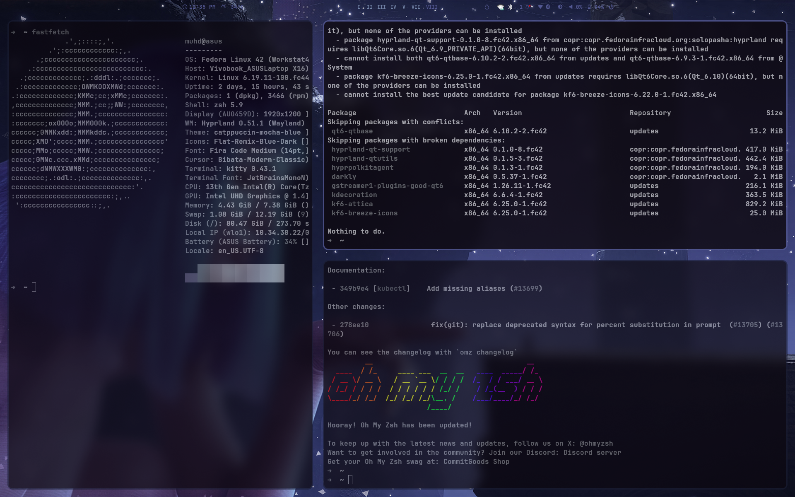

# Fedora Hyprland Rice

A clean and minimal Fedora Hyprland setup inspired by modern Linux ricing and JaKooLit-style workflows.

## Components

- WM: Hyprland
- Bar: Waybar
- Terminal: Kitty
- Launcher: Rofi
- Notifications: SwayNC
- Logout Menu: Wlogout
- Theme Engine: Wallust
- GTK Theme: GTK 3 / GTK 4

## Preview



## Installation

```bash
git clone https://github.com/muhdshahidlc/feodra-rice.git
cd feodra-rice
chmod +x install.sh
./install.sh
'''

## Included Configs

* Hyprland window manager configuration
* Waybar themes and layouts
* Rofi launcher themes
* Kitty terminal setup
* GTK theming
* Notification center setup
* Wallpaper color generation using Wallust

## Notes

* Fedora-based setup
* Minimal and aesthetic workflow focused
* Inspired by JaKooLit + modern Linux rice setups

## Author

Made by Mohd Shahid

